


 


  

I build production-ready web apps and AI-powered tools, and write about what I learn on my <a href="https://karan-gobade.onrender.com/">dev blog</a>.

  

<table>
<tr>
<td><a href="https://github.com/karangobade/smart-job-scam-detector"></a></td>
<td><a href="https://karan-gobade.onrender.com/"></a></td>
</tr>
<tr>
<td><a href="https://github.com/karangobade/ai-text-classification-app"></a></td>
<td><a href="https://github.com/karangobade/finance-tracker"></a></td>
</tr>
<tr>
<td><a href="https://github.com/karangobade/Bug-Tracking-System"></a></td>
<td><a href="https://github.com/karangobade/Dashboard-Management-System-Using-Python-Flask"></a></td>
</tr>
<tr>
<td><a href="https://github.com/karangobade/trading_bot"></a></td>
<td><a href="https://github.com/karangobade/student_management"></a></td>
</tr>
</table>

Blog source code: <a href="https://github.com/karangobade/karan-blog">github.com/karangobade/karan-blog</a>


<b>9 certifications (click to collapse)</b>

 

| Certification | Issuer | Date |
|:--|:--|:--|
| ☁️ Oracle Cloud Infrastructure 2025, Foundations Associate | Oracle | May 2026 |
| 🌐 JavaScript for Beginners | Simplilearn SkillUp | May 2026 |
| 🧪 Introduction to Software Testing | Simplilearn SkillUp | Feb 2026 |
| ⚡ Code Generation with Generative AI | Simplilearn SkillUp | Feb 2026 |
| 🗄️ MongoDB Overview: Core Concepts & Architecture | MongoDB, Inc. | Dec 2025 |
| 🐍 Data Structures & Algorithms in Python | Simplilearn | Dec 2025 |
| 🧠 Prompt Engineering with GitHub Copilot | Microsoft & Simplilearn | Nov 2025 |
| 🤖 Computer Vision App with Azure Cognitive Services | Microsoft / Coursera | Aug 2025 |
| 🛡️ Network Security Associate | Fortinet & EduSkills / AICTE | Mar 2024 |

<picture>
  <source media="(prefers-color-scheme: dark)" srcset="https://raw.githubusercontent.com/karangobade/karangobade/output/github-snake-dark.svg"/>
  <source media="(prefers-color-scheme: light)" srcset="https://raw.githubusercontent.com/karangobade/karangobade/output/github-snake.svg"/>
  
</picture>

### Let's build something together

